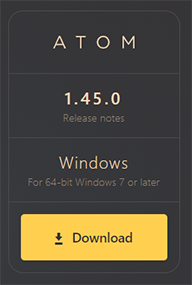

.. _install:

Install Atom
================
Follow these step-by-step instructions to install Atom on your computer.

#. Go to `https://atom.io <https://atom.io>`_. Above **Download** you should see listed your computer's specific operating system (OS) and version.

For example, someone with a pc running Windows 10 would see this when they go to Atom:

2. If the OS/version information is correct for your system, click the **Download** button and follow the on-screen instructions to complete the installation.

If the OS/version information is not correct or you want to download Atom for a different operating system, follow these steps:

#. On the bottom left of the screen, click **Other platforms**. You will be taken to Atom's latest version release page on GitHub. You can also get there by clicking this link: `https://github.com/atom/ atom/releases/tag/v1.45.0 <https://github.com/atom/ atom/releases/tag/v1.45.0>`_.
#. Click **Assets** to open the list of the current available OS version downloadable files.
#. To download, click on the appropriate file name for your platform.
#. Open the downloaded file and follow the on-screen installation instructions.
