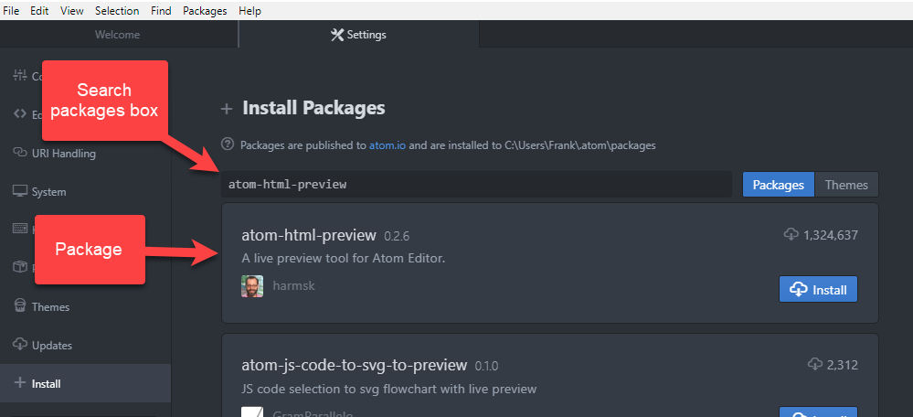

Atom Packages
================
Understanding packages opens up a world of additional features you can use in Atom.

When you download Atom, it comes with a lot of features. For example, Atom comes with syntax highlighting for HTML, but it does not come with syntax highlighting for RST. To get syntax highlighting for RST, you have to install it yourself. A package is what Atom calls a feature or group of features that you install after you download Atom.

* Packages are optional. You choose what packages you want to install from Atom's package list.
* Packages are free.
* 1-click installation. No code or command line steps necessary.
* Install a package anytime.
* Disable a package anytime.
* Access packages from the **Settings** panel. 
    - To access **Settings**, follow the appropriate path for your operating system: 
        - Mac: **Atom > Preferences**
        - Windows: **File > Settings**
    - **Packages** lists what packages are currently installed.
    - **Install** lists all additional packages available to install.

Below is an example image of the **Search Packages** box.

.. _searchpackages:

