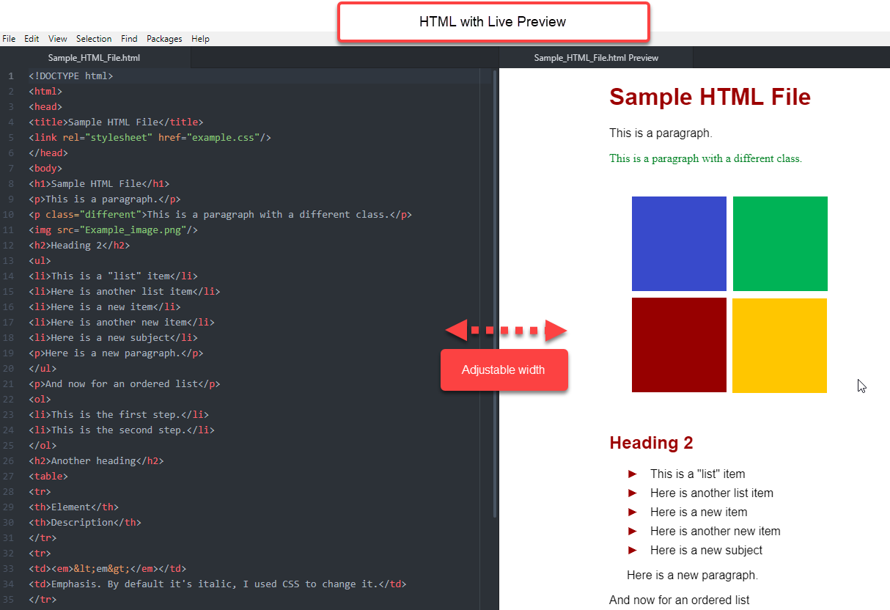

Live Preview
===============
The Live Preview window appears next to your source code. While you type your code, Live Preview shows what your source code will look like on a basic web page.

`Atom must be installed on your computer </Install_Atom.rst>`_ before you can set up additional features.

A text editor that offers a live preview window saves you time and frustration. One of the main challenges for beginning code writers is not knowing how the code you have written will look on a web page. A "live" preview window renders your code while you write, which is why live preview is an essential tool for the beginning code writer.

**How to set up and use live preview for HTML, Markdown, and RST:**

#. Open **Atom**.
#. Open **Settings** by clicking on the appropriate path for your operating system.
      - Mac: **Atom > Preferences**
      - Windows: **File > Settings**
#. On the left menu, click **Install**.
#. In the **Search Packages** box, type the package name you want to install from the table below.

.. list-table::
  :widths: 20 50
  :header-rows: 1

  * - Language
    - Preview Package Name
  * - HTML
    - ``atom-html-preview``
  * - Markdown
    - (none; already pre-loaded in Atom)
  * - RST
    - ``rst-preview``

The package box appears. For example, the image below shows the *atom-html-preview* package box.

.. image:: Images/searchpackages.png

.. image:: Images/searchpackages.png

   .. tip::

	There are many different packages that you can install in Atom. To explore the packages, scroll through the available packages listed in **Install Packages** or type in specific search words in the **Search Packages** box. To find out more about what each package does, click on the descriptive text below the title. (You can click on the title also. The information will be the same, but it will launch in atom.io in a new browser window.)

5. Click **Install**. After the preview package has installed, you can open a file and open (enable) the preview window. Continue to the next step to open the preview window or install additional packages by repeating the previous steps starting from Step 1.
#. Open a file saved in the same source code language as the preview package you installed. For example, if you installed *atom-html-preview*, then open a file already saved in .htm or .html or open a new file and save it as an .htm or .html file.

#. Open the preview window using drop-down menu or hotkey commands from the table below.

.. list-table:: Preview Pane Toggle Commands
  :widths: 20 50 30
  :header-rows: 1

  * - Language
    - Drop-Down Menu
    - HotKey Command
  * - HTML
    - Packages < Preview HTML < Enable Preview
    - ``Control + Shift + H``
  * - Markdown
    - Packages < Markdown Preview < Toggle Preview
    - ``Control + Shift + M``
  * - RST
    - Packages < reStructuredText < Toggle Preview
    - ``Control + Shift + R``

Preview now appears in a new window on the right side of your screen with your original source code file on the left.

.. tip::

  - After the preview window opens, your code file window narrows and the code does not automatically wrap. To enable text wrapping: From the top menu, click **View > Toggle Soft Wrap**.
  - The Markdown preview window background color can be white or black. This is a toggle command. The white background is "GitHub Style." To change the background color, click **Packages > Markdown Preview > Toggle GitHub Style**.

.. important::

  - You must enable the preview window every time you open your file.
  - You can open or close the preview window anytime using the toggle commands.
  - Hotkey and drop-down menu commands are interchangeable; you can use one method to open the preview pane and the other method to close it. For example, you can open preview using a hotkey command and close it using a drop-down menu, and vice versa.
