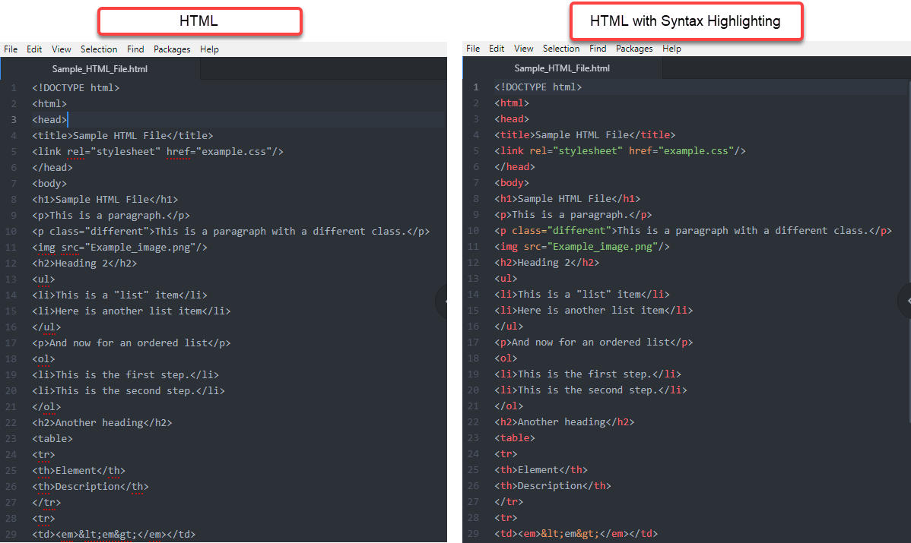

Syntax Highlighting
=====================
Syntax highlighting displays source code in different colors and fonts, so it's easier to distinguish code elements and identify errors.

`Atom must be installed </Install_Atom.rst>`_ on your computer before you can set up additional features.

HTML and Markdown syntax preview come pre-loaded in Atom, but RST does not. You will install the RST syntax highlighting package and then learn how to enable syntax highlighting for all of these languages.

**How to install the RST syntax highlighting package:**

#. Open **Atom**.
#. Open **Settings** by clicking on the appropriate path for your operating system.
    - Mac: **Atom > Preferences**
    - Windows: **File > Settings**
#. On the left menu, click **Install**.
#. In the `Search Packages </Images/searchpackages.png>`_ box, type: ``language-restructuredtext``. The *language-restructuredtext* package box appears.
#. Click **Install**.

**How to Enable Syntax Highlighting:**

#. Open a new file.
#. Type a few lines of HTML, Markdown, or RST.
#. Save the file using the appropriate language file extension from the table below.

.. list-table::
  :widths: 20 50
  :header-rows: 1

  * - Language
    - File Extension
  * - HTML
    - filename.htm or filename.html
  * - Markdown
    - filename.md
  * - RST
    - filename.rst

The file now appears with syntax highlighting.

.. note::

	- After the initial save, the file will always re-open with syntax highlighting.
	- After installing the packages, any previously saved .htm, .html, .md, or .rst file will open with syntax highlighting.
	- To "turn off" syntax highlighting for a particular language, you will need to disable the syntax highlighting package for that language. To do that, go to **Atom > Preferences > Packages**. You will see all of your currently installed packages. Find the appropriate package and click **Disable**.

Related Information:

- :doc: `Basic Syntax Comparison Chart <Syntax_Comparison>`_
- `Online Syntax Cheatsheets <../cheatsheets.rst>`_
